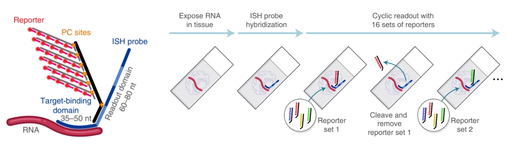
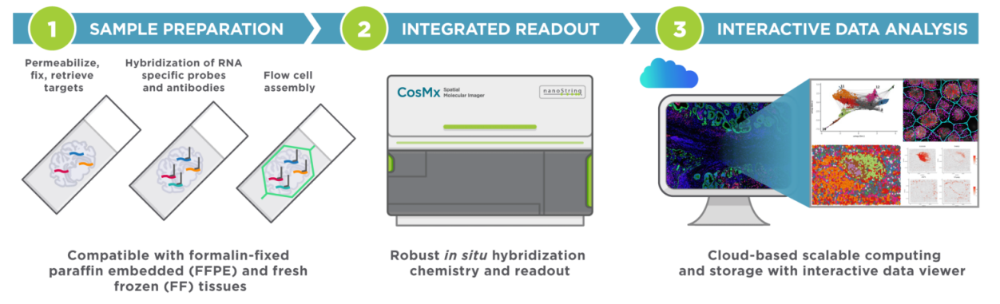

# cosMx-SMI使用手册
CosMx SMI是首个可对福尔马林固定石蜡包埋（FFPE）和新鲜冷冻（FF）组织等样本进行细胞和亚细胞分辨率空间多组学分析的高通量原位分析平台。SMI可对多达6000种RNA和64种经过验证的蛋白质实现快速定量和可视化分析。CosMx SMI是一个灵活的空间单细胞成像平台，能推动对细胞图谱、组织表型、细胞间相互作用和生物标志物发现的进一步发展。
# 1 介绍
## 1.1 技术原理
CosMx SMI是一种基于杂交的单分子条形码检测的、无酶、无核酸扩增的分析方法。
* ISH Target Probe: CosMx panel中的ISH 靶向探针（包含两个部分）：  
    * ①Target Binding Domain：通过杂交与内源mRNA结合；  
    * ②Reporter Readout Domain：为4个连续的reporter结合区域，每个区域仅与唯一对应的reporter结合； 
* Reporter Probe：与ISH靶向探针中reporter结合区域杂交配对的荧光报告探针； 
* Reporter Set：每轮杂交添加4种荧光探针。 

 
## 1.2 工作流程
* 固定并透化5μm FFPE或新鲜冷冻组织切片；
* RNA探针与组织样本中的内源RNA杂交；
* 清洗组织样本，然后与寡核苷酸标记的抗体孵育，进行形态学标志物染色；
* 上样至SMI仪器进行形态学标志物成像；
* 选择组织上所需的成像区域(最大300mm2)；
* 多轮报告子结合和荧光成像，读取每个成像的RNA探针或蛋白质抗体的荧光条形码信息。 

 
# 2 上游实验与数据处理
## 2.1 样本准备
## 2.2 CosMx SMI 实验流程
* 探针杂交
* RNA 读取与成像
## 2.3 数据处理

