# cosMx-SMI使用手册
CosMx SMI是首个可对福尔马林固定石蜡包埋（FFPE）和新鲜冷冻（FF）组织等样本进行细胞和亚细胞分辨率空间多组学分析的高通量原位分析平台。SMI可对多达6000种RNA和64种经过验证的蛋白质实现快速定量和可视化分析。CosMx SMI是一个灵活的空间单细胞成像平台，能推动对细胞图谱、组织表型、细胞间相互作用和生物标志物发现的进一步发展。
# 1 介绍
## 1.1 技术原理
CosMx SMI是一种基于杂交的单分子条形码检测的、无酶、无核酸扩增的分析方法。
* ISH Target Probe: CosMx panel中的ISH 靶向探针（包含两个部分）：  
    * ①Target Binding Domain：通过杂交与内源mRNA结合；  
    * ②Reporter Readout Domain：为4个连续的reporter结合区域，每个区域仅与唯一对应的reporter结合；<br>
* Reporter Probe：与ISH靶向探针中reporter结合区域杂交配对的荧光报告探针；<br>
* Reporter Set：每轮杂交添加4种荧光探针。<br>

<br>
## 1.2 工作流程
* 固定并透化5μm FFPE或新鲜冷冻组织切片；
* RNA探针与组织样本中的内源RNA杂交；
* 清洗组织样本，然后与寡核苷酸标记的抗体孵育，进行形态学标志物染色；
* 上样至SMI仪器进行形态学标志物成像；
* 选择组织上所需的成像区域FOV(最大300mm2)；
* 多轮报告子结合和荧光成像，读取每个成像的RNA探针或蛋白质抗体的荧光条形码信息。<br>

<br>
# 2 上游实验与处理
## 2.1 样本准备
## 2.2 CosMx SMI 实验流程
* 探针杂交
* RNA 读取与成像
* 细胞分割
# 3 下游数据处理
## 3.1 数据下载
这里使用NSCLS公开数据集中的一个重复进行示例：
```
wget https://staging.nanostring.com/resources/smi-ffpe-dataset-lung5-rep1-data/

tar xvfz Lung5_Rep1+SMI+Flat+data.tar.gz
```
解压之后可以看到这些文件：<br>
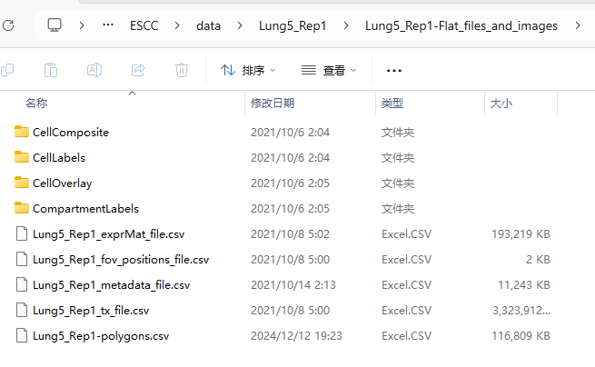<br>
使用Seurat创建对象进行后续分析：
```
library(Seurat)
setwd("E:/project/ESCC/data")
nano.obj <- LoadNanostring(data.dir = "./Lung5_Rep1/Lung5_Rep1-Flat_files_and_images", fov = "lung5.rep1")
```
## 3.2 细胞注释
对于这个数据集，我们并没有进行无监督分析，而是将Nanostring的分析结果与Azimuth健康人类肺脏参考数据库进行对比，这个数据库是通过单细胞RNA测序（scRNA-seq）技术建立的。我们使用的是Azimuth软件的0.4.3版本以及人类肺脏参考数据库的1.0.0版本。你可以从[注释信息](https://seurat.nygenome.org/vignette_data/spatial_vignette_2/nanostring_data.Rds)这个链接下载预先计算好的分析结果，这些结果包括了注释信息、预测分数以及UMAP的可视化图。每个细胞平均检测到的转录本数量是249，这在进行细胞注释时确实带来了一定的不确定性。
```
azimuth.data <- readRDS("../ref/nanostring_data.Rds")
nano.obj <- AddMetaData(nano.obj, metadata = azimuth.data$annotations)
nano.obj[["proj.umap"]] <- azimuth.data$umap
Idents(nano.obj) <- nano.obj$predicted.annotation.l1
```
## 3.3 预处理与标准化
SCTransform函数是一种数据标准化和变量选择的方法，它通过正则化和缩放数据来减少技术变异，并提高数据的可比性。
```
# set to avoid error exceeding max allowed size of globals
options(future.globals.maxSize = 8000 * 1024^2)
nano.obj <- SCTransform(nano.obj, assay = "Nanostring", clip.range = c(-10, 10), verbose = FALSE)

# text display of annotations and prediction scores
head(slot(object = nano.obj, name = "meta.data")[2:5])
```

## 3.4 UMAP降维
我们可以可视化 Nanostring 细胞和注释，并使用UMAP降维。请注意，对于此 NSCLC 样本，肿瘤样本被注释为“基础”，这是健康参考中最接近的细胞类型匹配。
```
DimPlot(nano.obj)
```
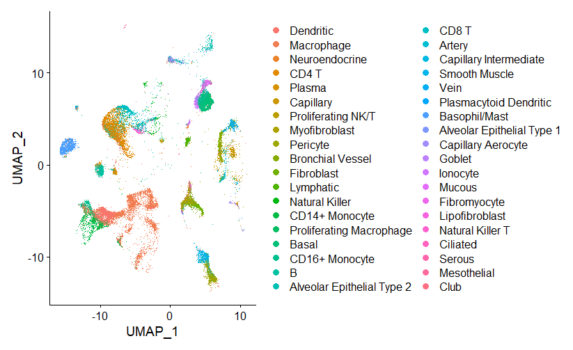<br>
## 3.5 常规方法--无监督聚类
这里标准化也可以使用单细胞测序的常规方法：
```
nano.obj <- NormalizeData(nano.obj)
nano.obj <- ScaleData(nano.obj)
nano.obj <- FindVariableFeatures(nano.obj)
```
然后PCA降维：
```
nano.obj <- RunPCA(nano.obj, features = VariableFeatures(object = nano.obj))
nano.obj <- RunUMAP(nano.obj, dims = 1:50)
```
聚类：
```
nano.obj <- FindNeighbors(nano.obj, reduction = "pca", dims = 1:50)
nano.obj <- FindClusters(nano.obj, resolution = 0.3)

DimPlot(nano.obj, raster = FALSE, label = TRUE)
```
细胞注释：
```
cluster_markers <- FindAllMarkers(nano.obj, only.pos = TRUE, min.pct = 0.25, logfc.threshold = 0.25)
list_marker <- cluster_markers %>% group_by(cluster) %>% top_n(n = 10, wt = avg_log2FC)
df_marker=data.frame(p_val = list_marker$p_val,
                     avg_log2FC = list_marker$avg_log2FC,
                     pct.1 = list_marker$pct.1,
                     pct.2 = list_marker$pct.2,
                     p_val_adj = list_marker$p_val_adj,
                     cluster = list_marker$cluster,
                     gene = list_marker$gene)
write.csv(df_marker,"marker.csv")

nano.obj <- RenameIdents(nano.obj, '0' = "Tumor", '1' = "Macro", '2' = "Fibro_SMC", '3' = "T_NK", '4' = "Neutro", '5' = "Endo_Peri", '6' = "B", '7' = "Plasma B", '8' = "Plasma B", '9' = "Mono", '10' = "Epi", '11' = "Mast", '12' = "A_SMC")

DimPlot(nano.obj, reduction = "umap", label = TRUE, pt.size = 0.5)
```
<br>
# 4 细胞类型和表达定位模式的可视化
ImageDimPlot() 这个函数会根据细胞在空间上的分布位置来绘制它们，并依据细胞被指定的类型来对它们进行颜色标记。可以观察到，基底细胞群（也就是肿瘤细胞）在空间上的排列非常紧凑有序，这与我们的预期是一致的。
```
ImageDimPlot(nano.obj, fov = "lung5.rep1", axes = TRUE, cols = "glasbey")
```
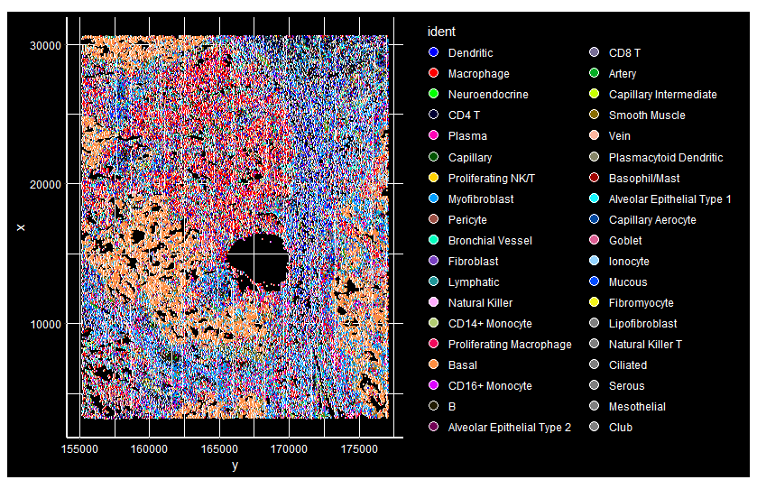<br>
可以突出显示一些选定组的定位：
```
ImageDimPlot(nano.obj, fov = "lung5.rep1", cells = WhichCells(nano.obj, idents = c("Basal", "Macrophage", "Smooth Muscle", "CD4 T")), cols = c("red", "green", "blue", "orange"), size = 0.6)
```
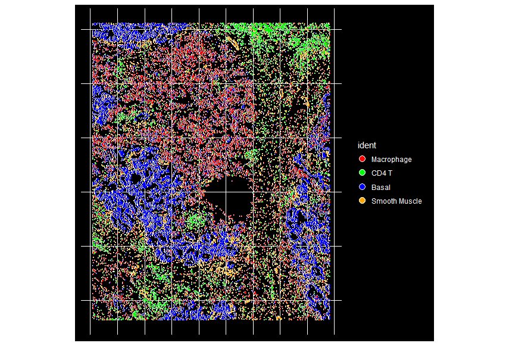<br>
# 5 可视化基因表达标记
KRT17是上皮基底细胞的标志物，下面以它为例进行可视化
## 5.1 VlnPlot
```
VlnPlot(nano.obj, features = "KRT17", assay = "Nanostring", layer = "counts", pt.size = 0.1, y.max = 30) + NoLegend()
```
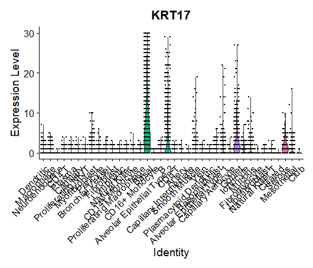<br>
## 5.2 FeaturePlot
```
FeaturePlot(nano.obj, features = "KRT17", max.cutoff = "q95")
```
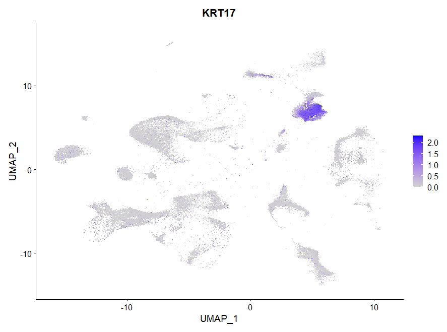
## 5.3 ImageFeaturePlot
```
ImageFeaturePlot(nano.obj, fov = "lung5.rep1", features = "KRT17", max.cutoff = "q95")
```
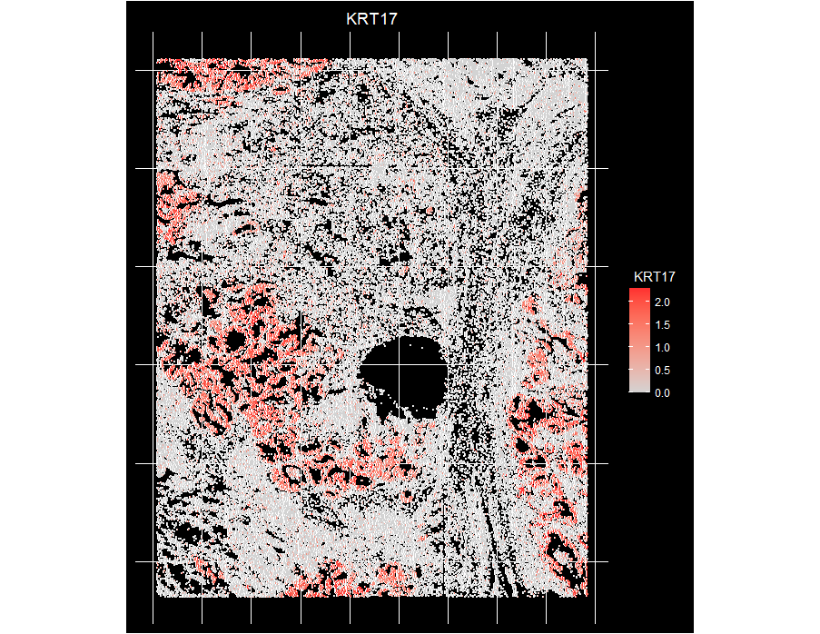
## 5.4 ImageDimPlot
```
ImageDimPlot(nano.obj, fov = "lung5.rep1", alpha = 0.3, molecules = "KRT17", nmols = 10000) + NoLegend()
```
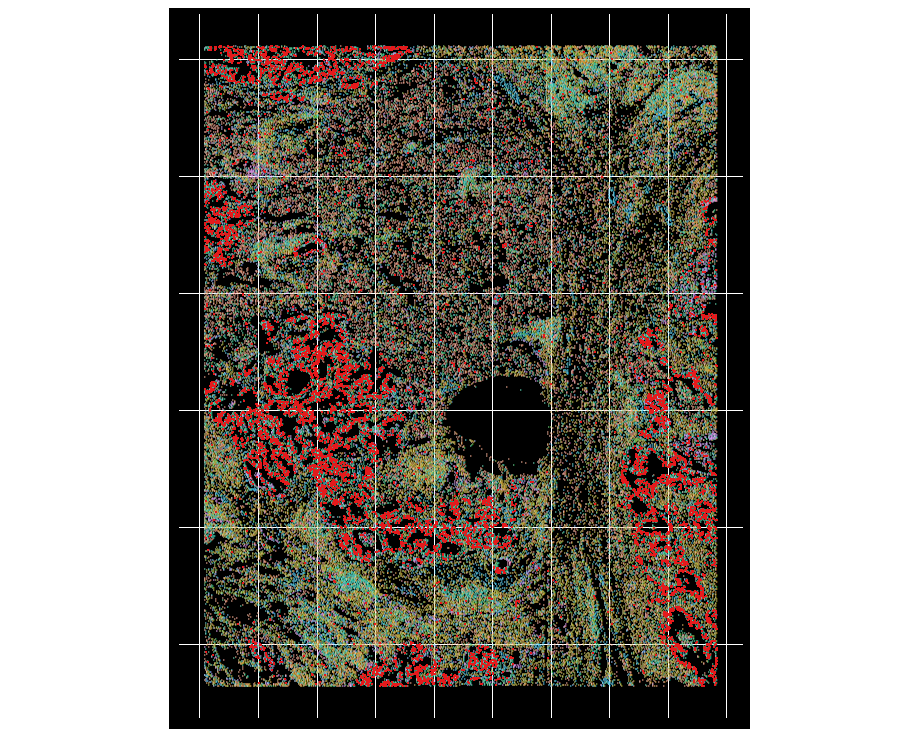<br>
* 还可以共同可视化多个标记物的表达，包括 KRT17（基底细胞）、C1QA（巨噬细胞）、IL7R（T 细胞）和 TAGLN（平滑肌细胞）。
```
ImageDimPlot(nano.obj, fov = "lung5.rep1", group.by = NA, alpha = 0.3, molecules = c("KRT17", "C1QA", "IL7R", "TAGLN"), nmols = 20000)
```
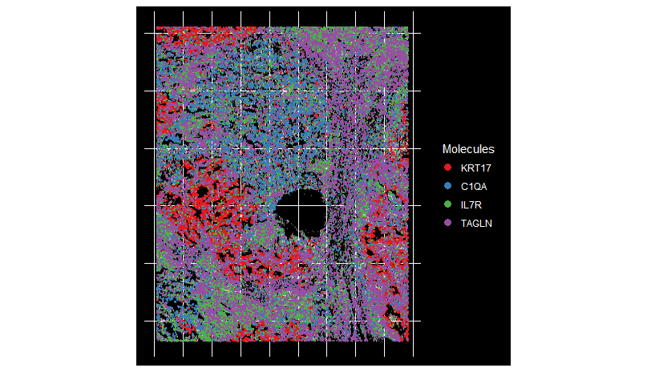<br>
* 还可以使用 Crop() 函数放大一个富含基底的区域。放大后，可以看见单个细胞边界。
```
basal.crop <- Crop(nano.obj[["lung5.rep1"]], x = c(159500, 164000), y = c(8700, 10500))
nano.obj[["zoom1"]] <- basal.crop
DefaultBoundary(nano.obj[["zoom1"]]) <- "segmentation"
ImageDimPlot(nano.obj, fov = "zoom1", cols = "polychrome", coord.fixed = FALSE)
```
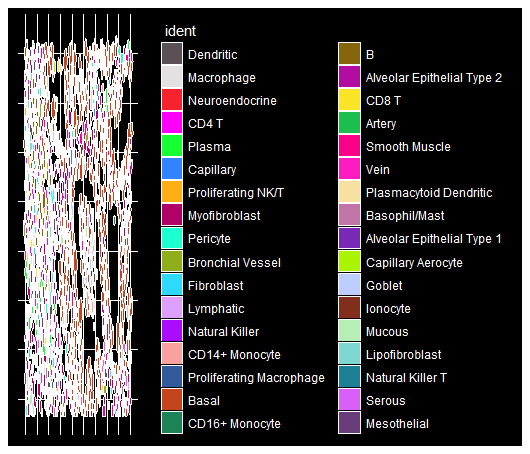<br>
* 注释细胞和标志物
```
ImageDimPlot(nano.obj, fov = "zoom1", cols = "polychrome", alpha = 0.3, molecules = c("KRT17", "IL7R", "TPSAB1"), mols.size = 0.3, nmols = 20000, border.color = "black", coord.fixed = FALSE)
```
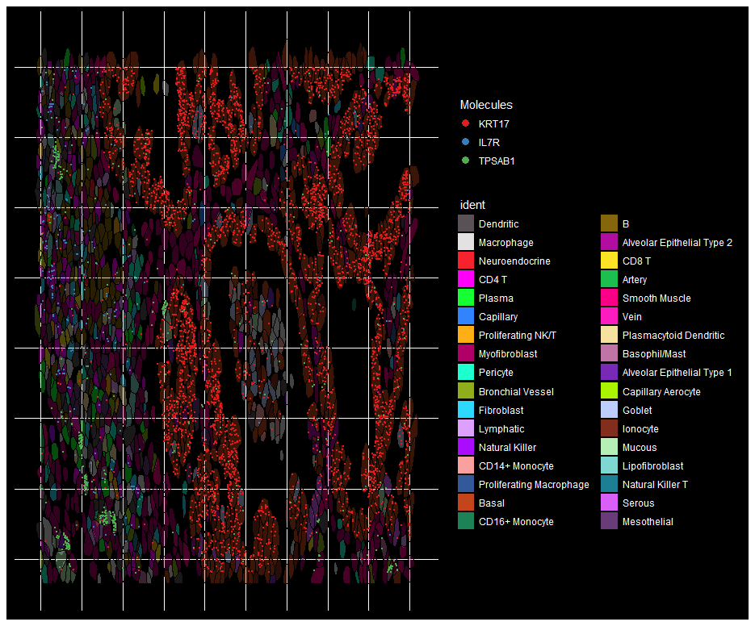<br>

